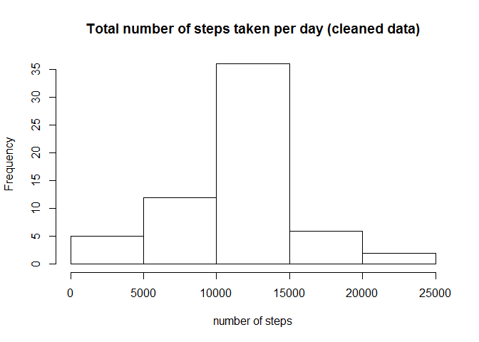

# Reproducible Research: Peer Assessment 1


## Loading and preprocessing the data


```r
library(dplyr)
```

```
## Warning: package 'dplyr' was built under R version 3.3.3
```

```
## 
## Attaching package: 'dplyr'
```

```
## The following objects are masked from 'package:stats':
## 
##     filter, lag
```

```
## The following objects are masked from 'package:base':
## 
##     intersect, setdiff, setequal, union
```

```r
library(readr)
library(lattice)
```


```r
activity <- read_csv("C:/Users/martiene.franzen/Desktop/Coursera/activity/activity.csv", 
    col_types = cols(date = col_date(format = "%Y-%m-%d"), 
        steps = col_number()))
```

## What is mean total number of steps taken per day?


```r
activity.date <- aggregate(steps ~ date, data = activity, FUN = sum)
```

1. Make a histogram of the total number of steps taken each day


```r
hist(activity.date$steps, main = "Total number of steps taken per day", xlab = "number of steps")
```

<!-- -->

2. Calculate and report the mean and median total number of steps taken per day


```r
mean(activity.date$steps)
```

```
## [1] 10766.19
```

### The mean number of steps taken per day: 10766


```r
median(activity.date$steps)
```

```
## [1] 10765
```

### The median of number of steps taken per day: 10765

## What is the average daily activity pattern?

1. Make a time series plot (i.e. type = "l") of the 5-minute interval (x-axis) and the average number of steps taken, averaged across all days (y-axis)


```r
activity.interval <- aggregate(steps ~ interval, data = activity, FUN = mean)
plot(steps ~ interval, data = activity.interval, type = "l", main = "Average number of steps across all days by interval")
```

<!-- -->

2. Which 5-minute interval, on average across all the days in the dataset, contains the maximum number of steps?


```r
activity.interval[which.max(activity.interval$steps), ]$interval
```

```
## [1] 835
```

### Interval 835 contains the maximum number of steps


## Imputing missing values

1. Calculate and report the total number of missing values in the dataset (i.e. the total number of rows with NAs)

```r
sum(is.na(activity$steps))
```

```
## [1] 2304
```
### The number of missing values in the column steps of the activity dataset is 2304.

2. Devise a strategy for filling in all of the missing values in the dataset. The strategy does not need to be sophisticated. For example, you could use the mean/median for that day, or the mean for that 5-minute interval, etc.

### My solution is to replace the missing with the mean for the 5-minute interval. See for code below point 3.

3. Create a new dataset that is equal to the original dataset but with the missing data filled in.


```r
activity.no.missing <- activity

activity.no.missing <-  left_join(x=activity.no.missing, y=activity.interval, by = "interval")

activity.no.missing$steps <- ifelse(!is.na(activity.no.missing$steps.x), activity.no.missing$steps.x, activity.no.missing$steps.y)

activity.no.missing <- subset(activity.no.missing, select = -c(steps.x,steps.y) )

activity.no.missing$steps <- round(activity.no.missing$steps, digits=0) 
```

4. Make a histogram of the total number of steps taken each day and Calculate and report the mean and median total number of steps taken per day. Do these values differ from the estimates from the first part of the assignment? What is the impact of imputing missing data on the estimates of the total daily number of steps?


```r
activity.no.missing.date <- aggregate(steps ~ date, data = activity.no.missing, FUN = sum)
hist(activity.no.missing.date$steps, main = "Total number of steps taken per day (cleaned data)", xlab = "number of steps")
```

<!-- -->


```r
mean(activity.no.missing.date$steps)
```

```
## [1] 10765.64
```

### The mean number of steps taken per day: 10766. The difference between this dataset and the dataset with missing values is minimal.


```r
median(activity.no.missing.date$steps)
```

```
## [1] 10762
```

### The median of number of steps taken per day: 10762. The median of the dataset with missing values is 10765. The difference is 3 steps.

## What is the average daily activity pattern?

## Are there differences in activity patterns between weekdays and weekends?

1. Create a new factor variable in the dataset with two levels -- "weekday" and "weekend" indicating whether a given date is a weekday or weekend day. For this part the weekdays() function may be of some help here. Use the dataset with the filled-in missing values for this part.


```r
activity.no.missing$days <- weekdays(activity.no.missing$date)

activity.no.missing$wdays <- if_else(activity.no.missing$days %in% c("zaterdag", "zondag"), "weekend days", "weekday")
activity.no.missing.interval <- aggregate(steps ~ interval+wdays, data = activity.no.missing, FUN = mean)
```


2. Make a panel plot containing a time series plot (i.e. type = "l") of the 5-minute interval (x-axis) and the average number of steps taken, averaged across all weekday days or weekend days (y-axis). 


```r
par(mfrow = c(1,2))
```


```r
xyplot(steps ~ interval| factor(wdays), data = activity.no.missing.interval, type = "l", main = "Average number of steps across all days by interval")
```

<!-- -->
